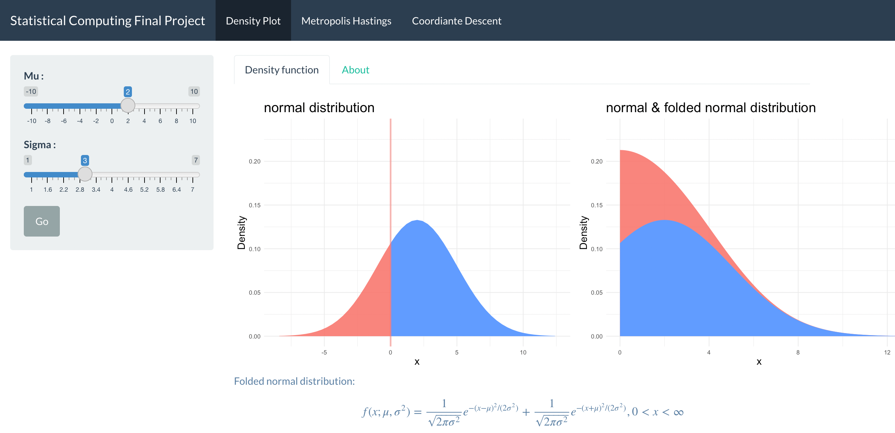
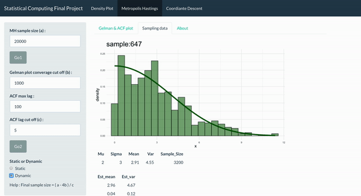
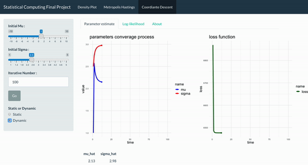

# 統計計算期末專案

## 【專案宗旨】
讓使用者輕易地透過點擊體驗到抽驗、篩選樣本，以及估計的整個流程，並全程轉為可視化的圖像及影像  

## 【內容】
網站內容分為三大主頁，以及主頁內的副頁
### 1. Density Plot  
    1.1 Density function  
    1.2 About

以 folded normal distribution 為主要分配，讓使用者自行調控該分配對應的參數，並透過視覺化的方式比較 folded normal 與 normal distribution 的相同與相異之處，以及該分配的基本介紹  

**備註**： 
folded normal 與 normal distribution 皆具有兩個參數分別為 $\mu$, $\sigma$，但此處 $\mu$, $\sigma$ 的意義與 normal distribution 不相同 !!!  

「*Wikipedia Folded normal distribution*」: https://en.wikipedia.org/wiki/Folded_normal_distribution

### 2. Metropolis Hastings  
    2.1 Gelman & ACF plot  
    2.2 Sampling data  
    2.3 About  

針對 `Page 1.1` 所設定的分配，透過 Metropolis-Hastings algorithm 進行抽樣，其中使用者可自行決定想要抽樣的次數，並透過 Gelman plot(check converge)、ACF plot(check indepedence) 決定要 cut off 的樣本數，且網頁會透過計算呈現出最終的有效樣本。

接著可於 `Page 2.2` 看見剩餘有效樣本的 Histogram plot， 同時還能由左側儀表板點選 Dynamic 按鈕，此時靜態的圖片將會以影像的方式呈現出抽樣的過程  

**備註**：若有效樣本數太大，Dynamic 製造的過程需要花上一段時間（預設約1-2分鐘）
  

「*Wikipedia Metropolis–Hastings algorithm*」: https://en.wikipedia.org/wiki/Metropolis%E2%80%93Hastings_algorithm

### 3. Coordinate Descent  
    3.1 Parameter estimate  
    3.2 Log-likelihood      
    3.3 About

利用 `Page 2.2` 所抽出的樣本反求 **Maximum Likelihood Estimation(MLE)** 透過 Coordinate Descent 的數值方法，並驗證與最初設定的參數一否一致，其中 *Coordinate Descent 起始值*、*有效樣本數等*，皆會影響最終的收斂結果，同時也可以於左側儀表板點選 Dynamic 按鈕，此時靜態的圖片將會以影像的方式呈現出估計收斂的過程  

並於 `Page 3.2` 用視覺方式呈現 Log-likelihood 的長相，以及 MLE 的位置

「*Wikipedia Coordinate descent*」: https://en.wikipedia.org/wiki/Coordinate_descent

## 備註：
> 目前已將網頁架設到雲端上，但因 Server 時常不太穩定，故要操作實際成果建議還是將 app.R 載入電腦中，於本地執行即可看見，並且相對穩定。  
網頁連結：https://w1lpqb-0-0.shinyapps.io/SC_final/

## 若有發現任何問題再煩請指教，感謝您的觀看！
